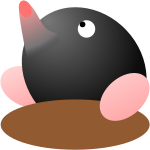

# Moles

A game of mole miners.



## To do (before initial release)

- Global multiplier upgrades?
- Documentation
- Animations / effects? (Dirt particles falling off of button maybe?)
- Content (maybe an hour or so of active play)
- Better README

## Project setup

```
npm install
```

### Compiles and hot-reloads for development

```
npm run serve
```

### Compiles and minifies for production

```
npm run build
```

### Lints and fixes files

```
npm run lint
```

### Customize configuration

See [Configuration Reference](https://cli.vuejs.org/config/).
