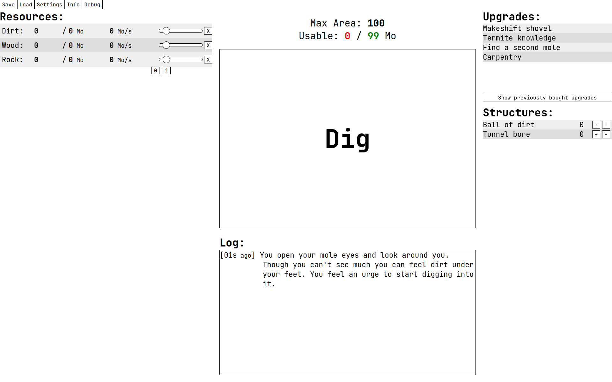

# Moles

<b><i>Moles</i></b> is an open-source, text-based incremental game,
built using Vue 3.

Play the game [here](https://kinseyda.github.io/moles/)!


## Project setup

If you want to run the game locally, first make sure Node and npm are installed and working.
Then clone the repository and run

```
npm install
```

Then run a development server with

```
npm run serve
```

## Background

Heavily inspired by other fantastic games in the incremental genre (most notably [Kittens Game](https://kittensgame.com/web/), [Universal Paperclips](https://www.decisionproblem.com/paperclips/), [Exponential Idle](https://conicgames.github.io/exponentialidle/) and [Antimatter Dimensions](https://ivark.github.io/)), Moles aspires to tell a story of infinite expansion in a supposedly finite universe.

Gameplay-wise, the game shall aim to avoid busy-work and mindless clicking, and strike a balance between transparency to the player and the fun of unraveling new mechanics. The player should always know what they are trying to achieve next, actively change or affect something to achieve it, and know that it will be useful, but perhaps not necessarily what new thing will happen exactly.



## Philosophy

These are some core tenets I created to help me think of the path I want the game to take.

### Game Design

- The game shall strive to make the player act with intention. Never clicking something just because they can, but because they know it will aid them in some specific or general way.
- The player should never get "stuck".
  - Progress should not be lost, and should only ever be stopped as a consequence for player actions.
- No endless or repetitive work.
  - Digging should always stop being useful at some point.
  - No repetivive clicking to gain resources, no complex / time-based population management.
- Encourage specialization.
  - Making the player sacrifice some resource storage temporarily is good, allowing the player to not interact with the area and storage system is bad.
  - Making the player create civilizations that are very good at exporting only a few resources is good.

### UI Design

- Every UI element should have a description/explanation, no exceptions. A player should reasonably be able to deduce what every button does, even with minimal exposure to the incremental genre.
- Text should be concise, seen in short but frequent bursts. Long stories are boring, reading events as they come into the log should be palatable even for players typically adverse to text-heavy games.

### Programming

- If 2 solutions to a problem exist, where one is more simple, and the other more complex but supported on older browsers, the simple solution should be chosen.
- Don't reinvent the wheel. Use Vue / other existing features in place of more code wherever possible. It will be more efficient than anything you would write.

### Content Theming

- Moles are industrious, clever, and ultimately short-sighted. They are driven enough to capitalize on anything by the desire to see numbers go up. They are not magical in any way (other than by being more dextrous than the moles in our universe), and achieve what they do via co-operation and their command of their resources (e.g. machinery).
- No fantasy / arcane elements. Real-world things should be used in fantastical ways. Moles do not ascend / meet God to reset the game, they build a catapult and fling themselves far away.
